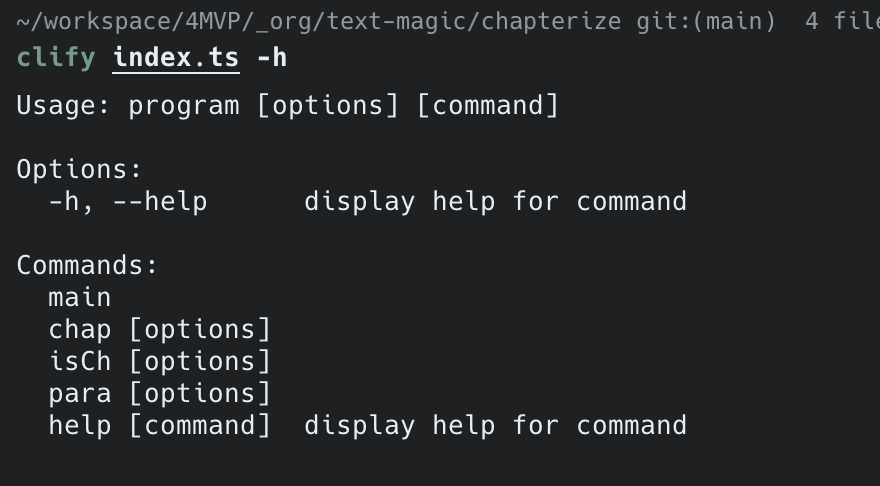

# clify

Turn your js/ts file into a CLI tool.

Imagine you have a file `paragraphize.ts`:

```ts
export function paragraphize(text: string) {
  return text.split(/(?:\r?\n){2,}/);
}

export default function defaultExport(text: string) {
  console.log("defaultExport", text);
}
```

You can run it like this:

```bash
clify paragraphize.ts main -t "Hello World" // Output: defaultExport Hello World
clify paragraphize.ts para -t "Hello World" // Output: [ 'Hello World' ]
```

## Usage

Install from npm:

TODO:

Install from source:

Requirements:
- bun
or
- node (This project is written in ts, but not using any Bun features, you can try to use node to run it)

```bash
git clone https://github.com/zh-impact/clify.git
cd clify
bun install
bun link
```

Then you can use it like this:


